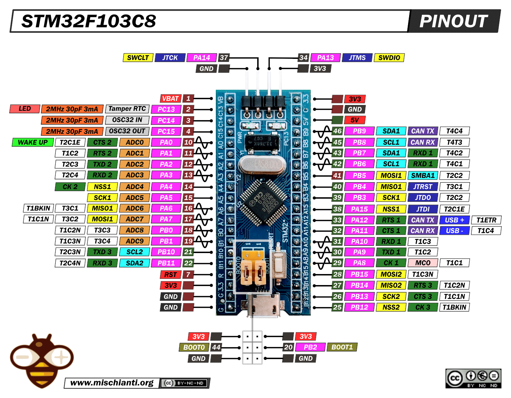
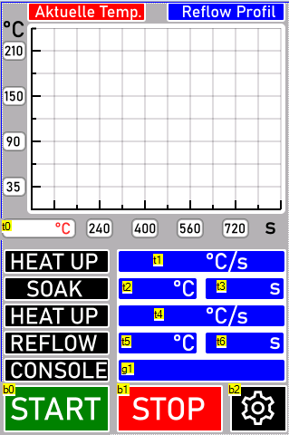
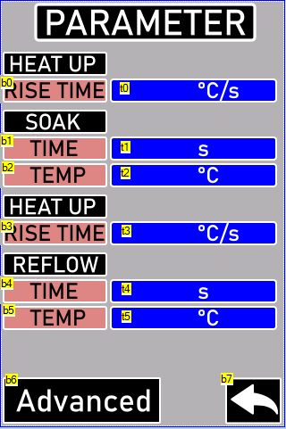
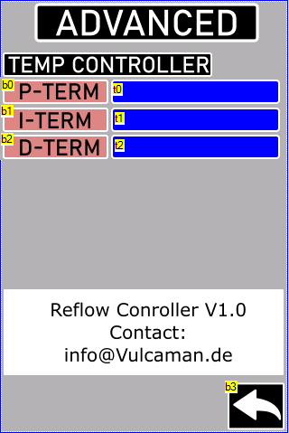

# Reflow Oven

---

# Prerelease Version

Reflow oven meant to be used by hardware and electronics. Includes various fixes

- Lack of source code. This repo provides the source code in addition to the binaries.
- Translation of German Code comments. I have kept the original text, and appended the translation side by side. Please do not delete the german comments.
- fix of several while loop and iterative mistakes. Modularization

## BOM

Note that this may be subject to change depending on department requirements

| Part                | Component                              | Quantity |
| ------------------- | -------------------------------------- | -------- |
| Microcontroller     | Blue Pill                              | 1        |
| Nextion Display     | TBD                                    | 1        |
| USB Power Source    | TBD                                    | 1        |
| Toaster Oven        | Generic                                | 1        |
| Thermo-coupler      | Any Generic (Ideally Type L or type J) | 1        |
| Logic Level Shifter | 3.3V to 5V (any generic)               | 1        |

# Block Diagram

# PID Controller

Effects of d term can vary. do not simply increase without reason.

# Configuration & Wiring

## Logic

| Bluepill Pin | Configuration  | Connecting Component | MC PIN # |
| ------------ | -------------- | -------------------- | -------- |
| PA14         | SYS_JTCK-SWCLK | St -link             | 38       |
| PA13         | SYS_JTMS-SWDIO | St - link            | 34       |
| PA10         | USART1_RX      | lv2 shifter board    | 31       |
| PA9          | USART1_TX      | lv3 shifter board    | 30       |
| PA8          | TIM_CH1        | Lv8 shifter board    | 29       |
| PA6          | SD             | S0 on sensor board   | 16       |
| PA5          | CK             | SCK on sensor board  | 15       |
| PA4          | CS             | CS on sensor board   | 14       |
| PD1-OSC_OUT  | RCC_OSC_OUT    | Not Used             | 6        |
| PD0-OSC_IN   | RCC_OSC_IN     | Not Used             | 5        |

## Power

| Function | Pin #'s    |
| -------- | ---------- |
| VDD      | 48, 36, 24 |
| VSS      | 47, 35, 23 |
| VDDA     | 9          |
| VSSA     | 8          |
| VBAT     | 1          |

## Reserved

| Name  | #   | Function    |
| ----- | --- | ----------- |
| NRST  | 7   | reset_state |
| BOOT0 | 44  | reset_state |

# Level Shifter Overview

| Pin Name | Function                                    |
| -------- | ------------------------------------------- |
| LV1      | No Connection                               |
| LV2      | Pin A10 on Blepill                          |
| LV       | Goes to 3.3V                                |
| GND      | Goes to ground                              |
| LV3      | Goes A9 on bluepill                         |
| lV4      | Goes to A8                                  |
| HV1      | No Connection                               |
| HV2      | TX on nextion display (transmit)            |
| HV       | Goes to 5.0 V                               |
| GND      | Goes to Ground                              |
| HV3      | Goes to Rx on nextion (receive)             |
| HV4      | Goes to orange wire (power signal for oven) |

# Legend for GUI

- 
  
  

| Prefix             | Description         |
| ------------------ | ------------------- |
| 'b'  is for button | Meant to be pressed |
| 't' is for text    | Meant to be read    |

# Future-Proofing:

- Add support for multiple thermocouplers

- Add buzzer for cooldown period

# Coding Overview

# To Do:

update stm binary and update nextion binary

~~refactor code for easier use~~

Pcb revision 1
